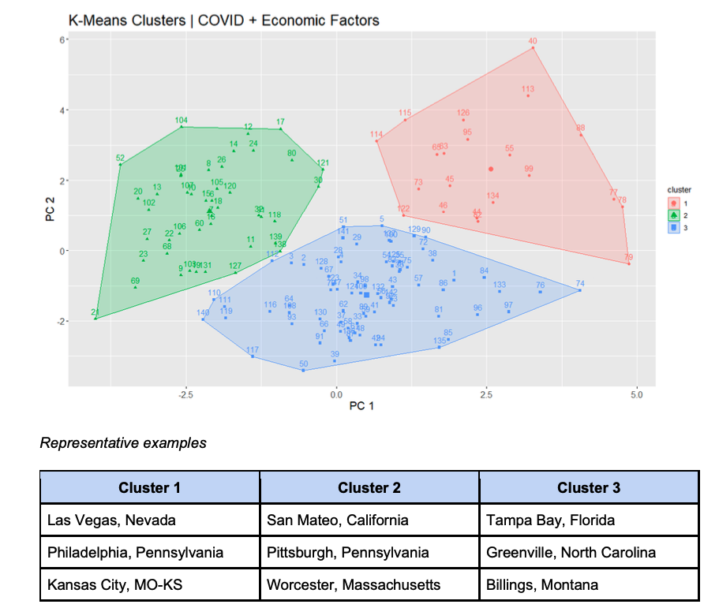

# 2020 Duke Datathon - Local-level economic impacts of COVID-19

## Description

On October 31, 2020, Duke Undergraduate Machine Learning hosted a 24-hour data science hackathon ("datathon") focused on both understanding and forecasting local-level economic impacts of the COVID-19 pandemic. The prompt was open-ended and challenged teams to both source their own data and analyze it to produce novel insights.

Our team created a data set that contained information of COVID-19 case counts, government interventions, and unemployment levels for counties within the United States. Using these information, we implemented a simple clustering algorithm to identify unique county "archetypes." While these archetypes were based on historical data, we assert in our report that these grouping can also inform the path to economic recovery for different localities.

This repository contains all of the data and code utilized to generate our final report (as well as said final report). In addition to general problem-solving with the team, I led our work on sourcing and analyzing unemployment data, so I'll feature some of that output in this README.

Our submission was chosen as one of four winning submissions among 300+ student entrants (with maximum group size of 5).

## Relevant files

- Instructions: The assignment given by the datathon organizers. To access, you may need the following password: f4J@-X7!qdR2LU2
- Final_Submission.pdf: Our final written report, which outlines our background research, data sources, methods, and results
- R/Datathon.Rmd: A single file, which contains all code used to generate our final deliverable. I wrote lines 25 - 340

## Methods for unemployment analysis

For the purpose of this project, we use unemployment rates as a proxy for overall economic well-being for a locality (which is supported in our literature review). For unemployment rates, we utilize the Current Population Survey (CPS), provided by the Integrated Public Use Microdata Series. From this source, we are able to obtain the total size of the labor force and the number of unemployed persons at a granular level within the US (e.g., by metropolitan area, by county).

While our analysis of the unemployment data is not overly sophisticated, the following skills are demonstrated:

- Sourcing relevant data, given an open-ended data science problem
- Detecting anamolies in unfamiliar data sets and making reasonable decisions about how to handle them (e.g., 0% unemployment for some localities)
- Simple time series visualizations
- Feature engineering based on observed trends and intution (e.g., creating rolling averages instead of relying on point-in-time unemployment estimates)
- Simple web scraping to handle information that is not in an easily consumable, tabular format 

## Plot showcase

### Final clustering results

### Unemployment rates over time for example cities

## Acknowledgements

- Duke Undergraduate Machine Learning hosted this datathon, and submissions were assessed by Duke University faculty
- For this project, I teammed up with three other first-year Master's student in Statistical Science at Duke: Marc Brooks, Jack McCarthy, Michael Sarkis
